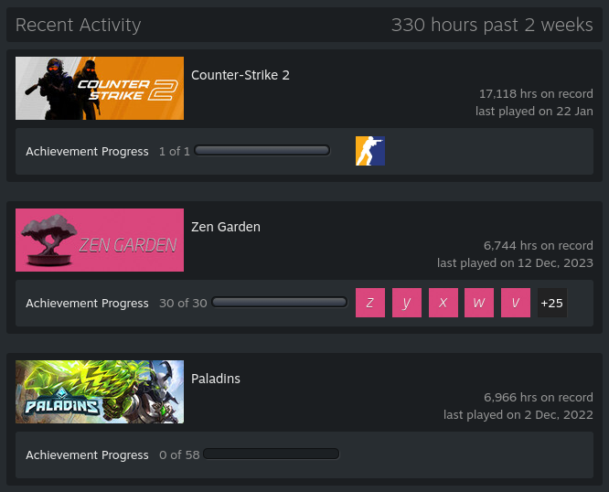

# steam-hour-booster
> Farm your in-game hours on Steam
- You can farm hours for **multiple games** on **multiple accounts** at once.
- Accounts with **Steam Guard** enabled are **supported**.
- Uses [node-steam-user](https://github.com/DoctorMcKay/node-steam-user) library.

<sub>*This software is not affiliated with Valve Corporation or Steam.*</sub>



## Table of contents
- [Requirements](#requirements)
- [Usage](#usage)
- [Configuration](#configuration)
- [Environment variables](#environment-variables)
- [Docker](#docker)
- [FAQ](#faq)

## Requirements
- [Bun](https://bun.sh/) (or [Docker](https://www.docker.com/))

## Usage

Install dependencies:
```bash
bun install
```

Run:
```bash
bun .
```

### Steam Guard
If your accounts have Steam Guard enabled, you will be prompted to enter Steam Guard code for each account.
Once logged in, a [refresh token](https://github.com/DoctorMcKay/node-steam-user?tab=readme-ov-file#using-refresh-tokens) will be stored and used to automatically log in to your accounts in the future.

### Run in the background
To take full advantage of this program, you most likely want to run it on a machine that is always running.\
I recommend using [Docker](#docker).

*Before running in the background, make sure to run it once normally to be able to enter your Steam Guard codes (if needed).*

## Configuration

Configuration consists of a JSON file containing a list of accounts to farm hours on.

Copy the default configuration:

```bash
cp config-example.json config.json
```

Edit the configuration file to your liking.

*Example configuration:*

```jsonc
[
    {
        "username": "foo",
        "password": "bar",
        "games": [730]
    }
]
```

You can add as many accounts as you want.

The `games` array contains the IDs of the games you want to farm hours for. Game IDs can be found on [SteamDB](https://steamdb.info/).\
I believe the maximum amount of games you can play at once on a single account is **32**.

You can also add `"online": true` to make the account appear online & in-game while farming hours. This is disabled by default.

## Environment variables
You can provide a `.env` file to configure environment variables. You probably won't need to modify these.

Copy the template:
```bash
cp .env.template .env
```

| Name | Description | Default value |
| --- | --- | --- |
| `CONFIG_PATH` | Path to the config file | `./config.json` |
| `STEAM_DATA_DIRECTORY` | Path to the directory where Steam will store it's data | `./steam-data` |
| `TOKEN_STORAGE_DIRECTORY` | Path to the directory where Steam refresh tokens will be stored, used for remembering sessions | `./tokens` |

## Docker

For Docker usage, see [here](https://hub.docker.com/r/drwarpman/steam-hour-booster).

## FAQ

### Can I get banned?
People have been using these kinds of "hour boosters" for years, without issues.\
Don't take my word for it though, use at your own risk.
